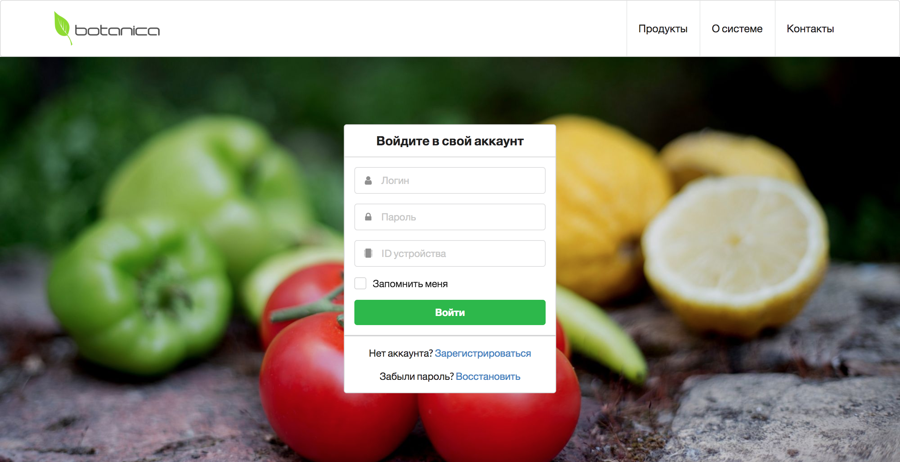
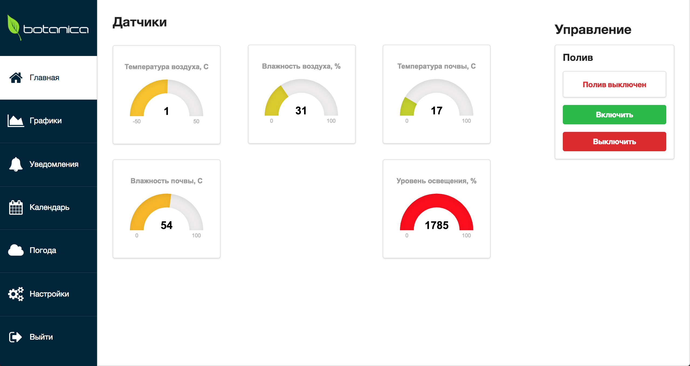

# Botanica

IoT project for remote control for greenhouses. This web application allows
 you to receive data from the greenhouse and control the irrigation remotely.

 Hardware: Arduino Leonardo + ESP8266 WiFi module + sensors (moisture,
 temperature, light) + electric pump.

 Software: Node.js + Mongo.db, Jade + Sass + SemanticUI, jQuery, Gulp, Bower.

 ## Screens

First screen web app

Second screen web app

First photo hardware

Second photo hardware

Third photo hardware

